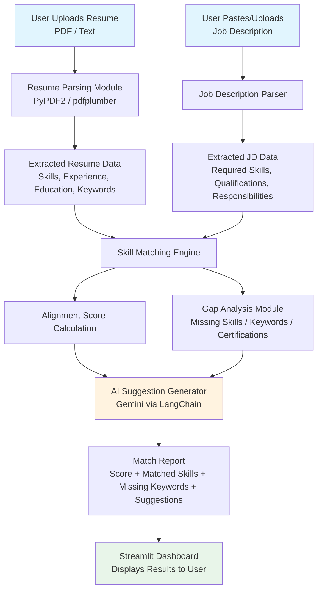

# AI-Powered Resume Analyzer

## Overview

Job seekers and professionals often struggle to understand how well their resume aligns with a specific job description. This project is an AI-powered Resume Analyzer that accepts a **resume** and a **job description** as inputs, evaluates skill and experience alignment, and returns a **match score** along with **actionable improvement suggestions**.

The goal is to help candidates:
- Beat ATS (Applicant Tracking System) keyword filters
- Understand exactly which skills/keywords are missing
- Get concrete, AI-generated suggestions to improve their resume before applying

## How It Works

Recruiters and ATS tools filter resumes based on keyword matching and skill alignment before a human ever reviews them. This tool reverses that process for the candidate: it extracts key skills, qualifications, and experience from both the resume and the job description, then uses **Gemini** to perform an intelligent comparison and produce a detailed match report — percentage score, matched skills, missing keywords, and specific suggestions.

> **Example:** A candidate applying for a Machine Learning Engineer role whose resume lacks "model deployment" or "MLOps tools" will have these gaps flagged, with recommendations on how to add them.

## Pipeline



**Flow summary:**
1. Resume and Job Description are uploaded/pasted by the user via the Streamlit UI.
2. Each is parsed separately to extract structured data (skills, experience, keywords).
3. The Skill Matching Engine compares both datasets and computes an alignment score.
4. The Gap Analysis Module identifies what's missing from the resume relative to the JD.
5. The AI Suggestion Generator (Gemini, orchestrated via LangChain) turns the raw gaps into specific, actionable recommendations.
6. Results are rendered back in the Streamlit Dashboard: score, matched skills, missing keywords, suggestions.

## Modular Components

| Module | Responsibility |
|---|---|
| **Resume Parsing Module** | Extracts skills, experience, education, and keywords from an uploaded PDF or text resume |
| **Job Description Parser** | Identifies required skills, qualifications, responsibilities, and keywords from the JD |
| **Skill Matching Engine** | Compares resume content against JD requirements and calculates an alignment score |
| **Gap Analysis Module** | Highlights missing skills, certifications, and keywords not present in the resume |
| **AI Suggestion Generator** | Uses Gemini to generate specific, actionable resume improvement recommendations |
| **Streamlit Dashboard** | Clean UI for resume/JD upload, score display, matched/missing skills, and suggestions |

## Tech Stack

| Category | Technology |
|---|---|
| Language | Python 3.14 |
| Package Manager | [uv](https://docs.astral.sh/uv/) |
| AI Model | Gemini |
| AI Orchestration | LangChain |
| Frontend | Streamlit |
| File Handling | PyPDF2 / pdfplumber |
| IDE | Antigravity IDE |

## Project Structure

```
AI-Powered-Resume-Analyzer/
├── pyproject.toml
├── uv.lock
├── .env                      # GEMINI_API_KEY etc. (gitignored)
├── .env.example
├── .gitignore
├── README.md
├── app.py                    # Streamlit entrypoint
└── src/
    └── resume_analyzer/
        ├── __init__.py
        ├── resume_parser.py       # Resume Parsing Module
        ├── jd_parser.py           # Job Description Parser
        ├── matching_engine.py     # Skill Matching Engine
        ├── gap_analysis.py        # Gap Analysis Module
        ├── suggestion_generator.py# AI Suggestion Generator (Gemini via LangChain)
        └── utils.py
```

## Local Setup (uv + Python 3.14)

### Prerequisites
- [uv](https://docs.astral.sh/uv/getting-started/installation/) installed
- Python 3.14 (uv can install/manage this for you)
- A Gemini API key

### 1. Initialize the project

If starting from scratch (no `pyproject.toml` yet):

```bash
uv init AI-Powered-Resume-Analyzer --python 3.14
cd AI-Powered-Resume-Analyzer
```

If you already have this repo cloned, just:

```bash
cd AI-Powered-Resume-Analyzer
uv python pin 3.14
```

### 2. Add dependencies

```bash
uv add streamlit langchain langchain-google-genai pypdf2 pdfplumber python-dotenv
```

### 3. Configure environment variables

Create a `.env` file in the project root:

```env
GEMINI_API_KEY=your_gemini_api_key_here
```

### 4. Run the app

```bash
uv run streamlit run app.py
```

uv will automatically sync the virtual environment (`.venv`) based on `pyproject.toml` / `uv.lock` before running the command — no manual `venv activate` needed.

### 5. Useful uv commands

```bash
uv sync                 # sync env to lockfile
uv add <package>        # add a new dependency
uv remove <package>     # remove a dependency
uv run python -m src... # run a module inside the managed env
uv lock --upgrade       # upgrade all dependencies
```

## Roadmap / Next Steps

- [ ] Set up `pyproject.toml` with dependencies via `uv add`
- [ ] Build `resume_parser.py` (PDF/text extraction)
- [ ] Build `jd_parser.py`
- [ ] Implement `matching_engine.py` (scoring logic)
- [ ] Implement `gap_analysis.py`
- [ ] Wire up Gemini via LangChain in `suggestion_generator.py`
- [ ] Build Streamlit dashboard (`app.py`)
- [ ] Add sample resumes/JDs for testing
- [ ] Add basic unit tests for parsing and scoring logic

## License

Internal project — usage subject to organizational guidelines.
